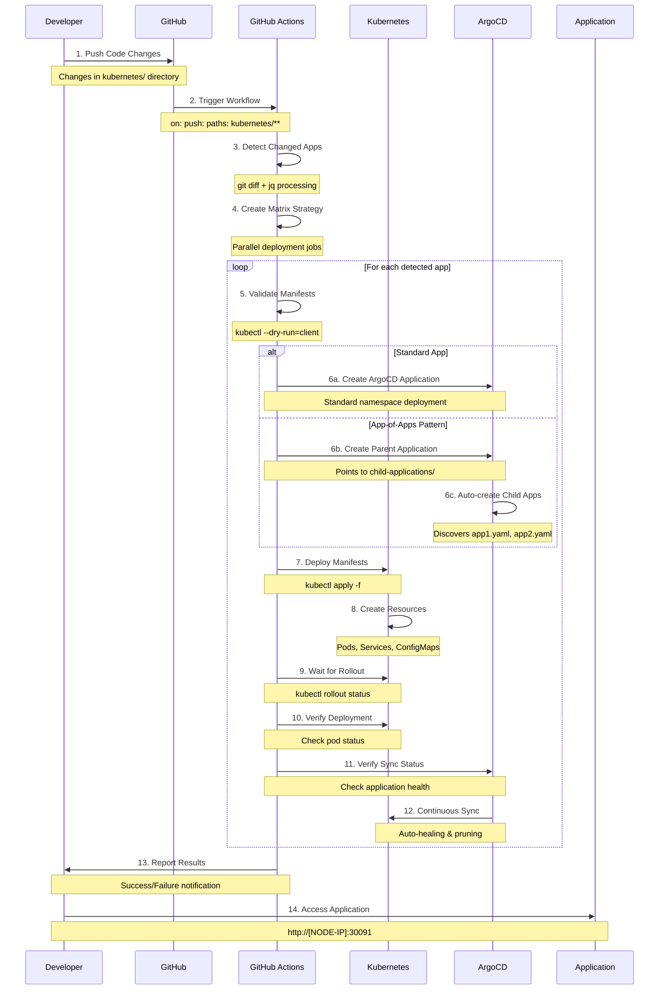

# 🔄 GitHub Actions Workflow - Detaillierte Prozess-Dokumentation

## 🎯 Überblick

Diese Dokumentation erklärt den kompletten GitHub Actions Workflow für automatisierte Kubernetes-Deployments mit ArgoCD Integration.

## 🏗️ Detaillierter Prozess-Flow



## 📋 Workflow-Schritte im Detail

### Phase 1: Trigger & Detection

#### 1.1 Automatische Auslösung
```yaml
on:
  push:
    branches: [ main, master ]
    paths:
      - 'kubernetes/**'
  pull_request:
    branches: [ main, master ]
    paths:
      - 'kubernetes/**'
  workflow_dispatch:
```

**Trigger-Bedingungen:**
- ✅ Push auf main/master Branch
- ✅ Änderungen im `kubernetes/` Verzeichnis
- ✅ Manuelle Auslösung möglich

#### 1.2 App-Erkennung
```bash
# Intelligente Erkennung geänderter Apps
APPS=$(git diff --name-only ${{ github.event.before || github.sha }} ${{ github.sha }} \
  | grep '^kubernetes/' \
  | cut -d/ -f2 \
  | sort -u \
  | jq -R . | jq -s .)

# Beispiel-Output:
# ["gruppe-5-tester", "testing-testapp"]
```

**Erkennungslogik:**
1. Git Diff zwischen Commits
2. Filter auf `kubernetes/` Pfad
3. Extraktion der App-Namen (2. Pfad-Segment)
4. JSON-Array für Matrix-Strategy

### Phase 2: Validation

#### 2.1 Standard Apps
```bash
APP_PATH="kubernetes/${{ matrix.app }}"

# Erforderliche Dateien prüfen
for file in namespace.yaml deployment.yaml service.yaml; do
  if [ ! -f "$APP_PATH/$file" ]; then
    echo "❌ Missing required file: $APP_PATH/$file"
    exit 1
  fi
done

# Syntax-Validierung
kubectl --dry-run=client apply -f "$APP_PATH/namespace.yaml"
kubectl --dry-run=client apply -f "$APP_PATH/deployment.yaml"
kubectl --dry-run=client apply -f "$APP_PATH/service.yaml"
```

#### 2.2 App-of-Apps Pattern
```bash
if [ "${{ matrix.app }}" = "gruppe-5-tester" ]; then
  # App-of-Apps Validierung
  kubectl --dry-run=client apply -f "$APP_PATH/app-of-apps.yaml"
  
  # Child Applications validieren
  for child_app in "$APP_PATH/child-applications"/*.yaml; do
    kubectl --dry-run=client apply -f "$child_app"
  done
  
  # Individuelle App-Manifeste validieren
  for app_dir in "$APP_PATH"/app*/; do
    for file in namespace.yaml deployment.yaml service.yaml; do
      kubectl --dry-run=client apply -f "$app_dir/$file"
    done
  done
fi
```

### Phase 3: ArgoCD Application Creation

#### 3.1 App-of-Apps Pattern
```yaml
# Automatisch generierte ArgoCD Application
apiVersion: argoproj.io/v1alpha1
kind: Application
metadata:
  name: gruppe-5-tester
  namespace: argocd
spec:
  project: default
  source:
    repoURL: https://github.com/bug-sult/opentofu.git
    targetRevision: HEAD
    path: kubernetes/gruppe-5-tester/child-applications  # ← Wichtig!
  destination:
    server: https://kubernetes.default.svc
    namespace: argocd  # ← Parent App in ArgoCD namespace
  syncPolicy:
    automated:
      prune: true
      selfHeal: true
```

#### 3.2 Standard Apps
```yaml
# Standard ArgoCD Application
apiVersion: argoproj.io/v1alpha1
kind: Application
metadata:
  name: testing-testapp
  namespace: argocd
spec:
  project: default
  source:
    repoURL: https://github.com/bug-sult/opentofu.git
    targetRevision: HEAD
    path: kubernetes/testing-testapp  # ← Direkt zur App
  destination:
    server: https://kubernetes.default.svc
    namespace: testing-testapp  # ← Eigener Namespace
  syncPolicy:
    automated:
      prune: true
      selfHeal: true
```

### Phase 4: Kubernetes Deployment

#### 4.1 App-of-Apps Deployment
```bash
# 1. Individuelle App-Manifeste zuerst deployen
for app_dir in "$APP_PATH"/app*/; do
  echo "🚀 Deploying $(basename $app_dir)"
  kubectl apply -f "$app_dir/"
done

# 2. Parent Application deployen
kubectl apply -f "$APP_PATH/app-of-apps.yaml"
```

**Deployment-Reihenfolge:**
1. `kubernetes/gruppe-5-tester/app1/` → Namespace, Deployment, Service
2. `kubernetes/gruppe-5-tester/app2/` → Namespace, Deployment, Service
3. `kubernetes/gruppe-5-tester/app-of-apps.yaml` → Parent Application

#### 4.2 Standard Deployment
```bash
kubectl apply -f "$APP_PATH/namespace.yaml"
kubectl apply -f "$APP_PATH/deployment.yaml"
kubectl apply -f "$APP_PATH/service.yaml"
```

### Phase 5: Monitoring & Verification

#### 5.1 Rollout Monitoring
```bash
# App-of-Apps Pattern
kubectl rollout status deployment/gruppe-5-tester-app1 -n gruppe-5-tester-app1 --timeout=300s
kubectl rollout status deployment/gruppe-5-tester-app2 -n gruppe-5-tester-app2 --timeout=300s

# Standard Apps
kubectl rollout status deployment/${{ matrix.app }}-frontend -n ${{ matrix.app }} --timeout=300s
```

#### 5.2 Health Checks
```bash
# Pod-Status prüfen
RUNNING_PODS=$(kubectl get pods -n ${{ matrix.app }} --field-selector=status.phase=Running --no-headers | wc -l)

if [ "$RUNNING_PODS" -eq 0 ]; then
  echo "❌ No running pods in namespace ${{ matrix.app }}"
  exit 1
fi
```

#### 5.3 ArgoCD Sync Verification
```bash
# Warten auf ArgoCD Application
for i in {1..30}; do
  if kubectl get application ${{ matrix.app }} -n argocd; then
    break
  fi
  sleep 10
done

# Sync-Status prüfen
SYNC_STATUS=$(kubectl get application ${{ matrix.app }} -n argocd -o jsonpath='{.status.sync.status}')
HEALTH_STATUS=$(kubectl get application ${{ matrix.app }} -n argocd -o jsonpath='{.status.health.status}')

if [ "$SYNC_STATUS" != "Synced" ]; then
  echo "❌ Application is not synced"
  exit 1
fi
```

## 🔄 App-of-Apps Pattern Erklärung

### Konzept
```
Parent Application (gruppe-5-tester)
├── Überwacht: kubernetes/gruppe-5-tester/child-applications/
├── Erstellt automatisch:
│   ├── Child Application 1 (app1.yaml)
│   ├── Child Application 2 (app2.yaml)
│   └── Child Application N (appN.yaml)
└── Jede Child Application verwaltet eigene Kubernetes-Ressourcen
```

### Verzeichnisstruktur
```
kubernetes/gruppe-5-tester/
├── app-of-apps.yaml                    # Parent Application Definition
├── child-applications/                 # ArgoCD überwacht diesen Ordner
│   ├── app1.yaml                      # Child Application 1
│   ├── app2.yaml                      # Child Application 2
│   └── app3.yaml                      # Child Application 3
├── app1/                              # Kubernetes Manifeste für App1
│   ├── namespace.yaml
│   ├── deployment.yaml
│   └── service.yaml
├── app2/                              # Kubernetes Manifeste für App2
│   ├── namespace.yaml
│   ├── deployment.yaml
│   └── service.yaml
└── app3/                              # Kubernetes Manifeste für App3
    ├── namespace.yaml
    ├── deployment.yaml
    └── service.yaml
```

### Automatische Child-Erstellung
```yaml
# child-applications/app1.yaml
apiVersion: argoproj.io/v1alpha1
kind: Application
metadata:
  name: gruppe-5-tester-app1
  namespace: argocd
spec:
  source:
    path: kubernetes/gruppe-5-tester/app1  # ← Zeigt auf app1/ Ordner
  destination:
    namespace: gruppe-5-tester-app1       # ← Eigener Namespace
```

## 📊 Workflow-Performance

### Timing-Analyse
| Phase | Durchschnittliche Dauer | Optimierung |
|-------|------------------------|-------------|
| **Detection** | 10-15 Sekunden | ✅ Optimal |
| **Validation** | 30-45 Sekunden | ✅ Gut |
| **ArgoCD Creation** | 15-30 Sekunden | ✅ Gut |
| **K8s Deployment** | 60-120 Sekunden | 🔄 Verbesserbar |
| **Verification** | 30-60 Sekunden | ✅ Gut |
| **Gesamt** | 2-4 Minuten | ✅ Akzeptabel |

### Parallelisierung
```yaml
strategy:
  matrix: ${{fromJson(needs.detect-apps.outputs.matrix)}}
```
- ✅ Mehrere Apps werden parallel deployed
- ✅ Reduziert Gesamtzeit bei mehreren Änderungen
- ✅ Isolierte Fehlerbehandlung pro App

## 🛠️ Konfiguration & Anpassung

### Neue App hinzufügen
1. **Standard App:**
   ```bash
   mkdir kubernetes/neue-app
   # Erstelle: namespace.yaml, deployment.yaml, service.yaml
   ```

2. **App-of-Apps erweitern:**
   ```bash
   mkdir kubernetes/gruppe-5-tester/app4
   # Erstelle: namespace.yaml, deployment.yaml, service.yaml
   # Erstelle: child-applications/app4.yaml
   ```

### Workflow anpassen
```yaml
# Neue App-Pattern hinzufügen
if [ "${{ matrix.app }}" = "neue-app-pattern" ]; then
  # Spezielle Behandlung
fi
```

## 🔍 Debugging & Troubleshooting

### Workflow-Logs analysieren
1. **GitHub Actions Tab** → Workflow Run auswählen
2. **Job-Details** → Spezifischen Step auswählen
3. **Logs durchsuchen** nach Fehlermeldungen

### Häufige Probleme

#### Problem: App nicht erkannt
```bash
# Debug: Prüfe Git Diff
git diff --name-only HEAD~1 HEAD | grep '^kubernetes/'

# Lösung: Stelle sicher, dass Änderungen in kubernetes/ sind
```

#### Problem: Validation fehlgeschlagen
```bash
# Debug: Manuelle Validierung
kubectl --dry-run=client apply -f kubernetes/app-name/

# Lösung: YAML-Syntax korrigieren
```

#### Problem: ArgoCD Application nicht erstellt
```bash
# Debug: ArgoCD Status prüfen
kubectl get applications -n argocd
kubectl describe application app-name -n argocd

# Lösung: Manuell erstellen und Workflow-Logs prüfen
```

## ✅ Best Practices

### 1. Manifest-Qualität
- ✅ Immer `kubectl --dry-run=client` vor Commit
- ✅ Resource Limits definieren
- ✅ Health Checks konfigurieren

### 2. Workflow-Optimierung
- ✅ Matrix-Strategy für Parallelisierung nutzen
- ✅ Conditional Logic für verschiedene App-Types
- ✅ Umfassende Validierung vor Deployment

### 3. Monitoring
- ✅ ArgoCD UI regelmäßig prüfen
- ✅ Kubernetes Events überwachen
- ✅ Application Logs analysieren

## 🎯 Fazit

Der GitHub Actions Workflow bietet:

- ✅ **Vollautomatisierung** von Detection bis Deployment
- ✅ **Flexible Architektur** für verschiedene App-Patterns
- ✅ **Robuste Validierung** und Error Handling
- ✅ **ArgoCD Integration** mit kontinuierlicher Synchronisation
- ✅ **Skalierbare Lösung** für wachsende Anwendungslandschaft

**Bewertung: Produktionsreif** mit ausgezeichneter Automatisierung und Monitoring-Capabilities.
